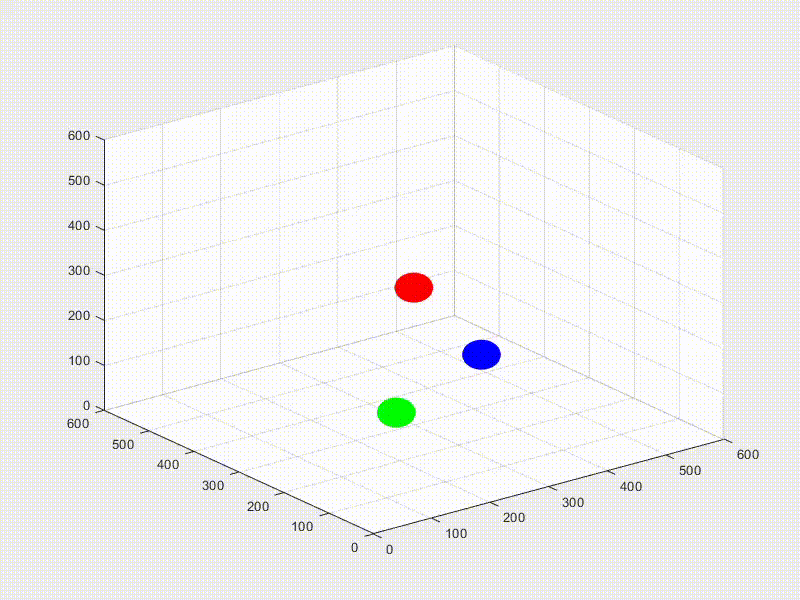

# Simulação de Colisão de Esferas 3D

Esta é uma simulação em MATLAB que cria uma animação interativa de três esferas em um espaço tridimensional. As esferas têm velocidades e cores diferentes, e a simulação demonstra suas trajetórias, colisões e interações em um ambiente virtual.

## Requisitos

Certifique-se de ter o MATLAB instalado em seu sistema antes de executar esta simulação.

## Execução

1. Clone ou faça o download deste repositório para sua máquina local.

2. Abra o MATLAB e navegue até o diretório onde os arquivos da simulação estão localizados.

3. Abra o arquivo `SphereCollision3D.m` no MATLAB.

4. Execute o script. Você verá uma janela de animação pop-up exibindo as esferas interagindo em um ambiente 3D.

## Detalhes da Simulação

### Parâmetros Iniciais

O código define algumas variáveis iniciais globais:

- `width`, `scene_height` e `depth`: Dimensões do espaço 3D.
- `pos`, `pos2` e `pos3`: Posições iniciais das três esferas.
- `vel`, `vel2` e `vel3`: Velocidades iniciais das esferas.
- `radius`: Raio das esferas.
- `color1`, `color2` e `color3`: Cores das esferas.

### Animação

A animação é criada por meio da função `draw_spheres_3D()`. Ela utiliza um loop que atualiza a posição das esferas com base em suas velocidades e lida com colisões com as paredes do espaço. As posições atualizadas são usadas para renderizar as esferas em suas novas posições a cada quadro.

### Colisões

A detecção de colisão é realizada por meio de verificações de distância entre as esferas. Se a distância entre duas esferas for menor do que duas vezes o raio, uma colisão é registrada. Isso é feito para todas as combinações possíveis de esferas.

### Geração de Vídeo

O código gera um arquivo de vídeo chamado `sphere_collision_animation.mp4`. Este arquivo de vídeo captura toda a animação da simulação, incluindo as colisões e interações entre as esferas.

## Configuração Personalizada

Se você deseja personalizar a simulação, você pode ajustar os seguintes parâmetros no código:

- `width`, `scene_height` e `depth` para dimensionar o espaço 3D.
- `vel`, `vel2` e `vel3` para alterar as velocidades das esferas.
- `radius` para definir o tamanho das esferas.
- `color1`, `color2` e `color3` para escolher as cores das esferas.

## Aviso

Esta simulação foi projetada para fins educacionais e de demonstração. A precisão física pode não ser rigorosa. Use-a para experimentar e aprender conceitos básicos de simulações em MATLAB.

## Autor

[Seu Nome]

## Licença

Este projeto está licenciado sob a Licença [Nome da Licença]. Consulte o arquivo `LICENSE` para obter mais detalhes.

---

